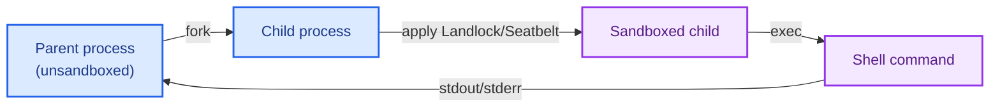

[nono](https://github.com/always-further/nono) provides OS-enforced sandboxing using kernel security frameworks: [Landlock](https://docs.kernel.org/userspace-api/landlock.html) on Linux and [Seatbelt](https://developer.apple.com/documentation/security) on macOS. Unlike cloud sandbox providers, nono runs locally on your machine with no containers, VMs, or remote APIs. Each command executes in a forked child process with kernel-enforced filesystem and network restrictions that cannot be bypassed from userspace.

| Platform | Mechanism | Minimum version |
|----------|-----------|-----------------|
| Linux    | Landlock LSM | Kernel 5.13+ |
| macOS    | Seatbelt | macOS 10.15+ |

## Installation

<CodeGroup>
```bash pip
pip install langchain-nono
```

```bash uv
uv add langchain-nono
```
</CodeGroup>

## Create a sandbox backend

nono does not require a provider SDK or account. Create the backend directly with a working directory and optional capability grants.

```python
from pathlib import Path

from langchain_nono import NonoSandbox

working_dir = Path("/tmp/agent-workspace")
working_dir.mkdir(parents=True, exist_ok=True)

backend = NonoSandbox(working_dir=str(working_dir))

result = backend.execute("echo hello")
print(result.output)
```

### Configure capabilities

Control what the sandbox can access. By default, the working directory gets read-write access and outbound network is blocked.

```python
from pathlib import Path

from langchain_nono import NonoSandbox

working_dir = Path("/tmp/agent-workspace")
model_dir = Path("/tmp/data/models")
scratch_dir = Path("/tmp/scratch")
for path in (working_dir, model_dir, scratch_dir):
    path.mkdir(parents=True, exist_ok=True)

backend = NonoSandbox(
    working_dir=str(working_dir),
    allow_read=[str(model_dir)],
    allow_readwrite=[str(scratch_dir)],
    block_network=True,
    timeout=300,
)
```

| Parameter | Default | Description |
|-----------|---------|-------------|
| `working_dir` | (required) | Absolute path granted read-write access |
| `allow_read` | `None` | Additional read-only paths |
| `allow_write` | `None` | Additional write-only paths |
| `allow_readwrite` | `None` | Additional read-write paths |
| `policy_json` | `None` | Raw JSON string containing a nono policy document |
| `policy_groups` | `None` | List of group names to resolve from the policy |
| `proxy_config` | `None` | `ProxyConfig` for network filtering and credential injection |
| `snapshot_session_dir` | `None` | Directory for snapshot storage. Enables snapshots when set. |
| `virtual_workspace_root` | `False` | Map Deep Agents-style absolute file paths like `/hello.py` into `working_dir` |
| `block_network` | `True` | Block all outbound network access |
| `timeout` | `1800` | Default command timeout in seconds |
| `max_output_bytes` | `1048576` | Maximum bytes of output to return |

## Define policies with JSON

For more complex access control, define a policy as a JSON document instead of using individual `allow_read`/`allow_write` parameters. A policy groups related capabilities together under named groups that you selectively activate.

### Policy structure

A policy document contains named **groups**, each defining a set of filesystem access rules:

```json
{
  "groups": {
    "workspace_rw": {
      "description": "Agent can modify its working directory",
      "allow": {
        "readwrite": ["/tmp/workspace"]
      }
    },
    "reference_read": {
      "description": "Agent can read reference material",
      "allow": {
        "read": ["/tmp/references"]
      }
    },
    "secrets_deny": {
      "description": "Deny access to secrets directory",
      "platform": "macos",
      "deny": {
        "access": ["/tmp/secrets"]
      }
    }
  }
}
```

Each group supports the following fields:

| Field | Description |
|-------|-------------|
| `description` | Human-readable description of the group's purpose |
| `platform` | Optional. Restrict the group to `"macos"` or `"linux"`. Skipped on other platforms. |
| `required` | Optional. If `true`, the group cannot be excluded when resolving. |
| `allow.read` | Paths to grant read-only access |
| `allow.write` | Paths to grant write-only access |
| `allow.readwrite` | Paths to grant read-write access |
| `deny.access` | Paths to explicitly deny all access (macOS only) |

Paths support `~` and `$HOME` expansion for the user's home directory.

### Load a policy inline

Build the policy as a Python dictionary and pass it as a JSON string:

```python
import json
from pathlib import Path
from langchain_nono import NonoSandbox

working_dir = Path("/tmp/agent-sandboxes")
reference_dir = Path("/tmp/references")
working_dir.mkdir(parents=True, exist_ok=True)
reference_dir.mkdir(parents=True, exist_ok=True)

policy_json = json.dumps(
    {
        "groups": {
            "workspace_rw": {
                "description": "Agent can modify its working directory",
                "allow": {"readwrite": [str(working_dir)]},
            },
            "reference_read": {
                "description": "Agent can read reference material",
                "allow": {"read": [str(reference_dir)]},
            },
        }
    }
)

sandbox = NonoSandbox(
    working_dir=str(working_dir),
    policy_json=policy_json,
    policy_groups=["workspace_rw", "reference_read"],
    block_network=True,
)
```

### Load a policy from a file

Store the policy as a JSON file and read it at startup:

```python
from pathlib import Path

from langchain_nono import NonoSandbox

working_dir = Path("/tmp/agent-sandboxes")
working_dir.mkdir(parents=True, exist_ok=True)
reference_dir = Path("/tmp/references")
reference_dir.mkdir(parents=True, exist_ok=True)

sandbox = NonoSandbox(
    working_dir=str(working_dir),
    policy_json=Path("policy.json").read_text(),
    policy_groups=["workspace_rw", "reference_read"],
    block_network=True,
)
```

<Note>
`policy_json` and `policy_groups` must be provided together. Passing `policy_json` without `policy_groups` (or vice versa) raises a `ValueError`.
</Note>

### Platform-specific groups

Use the `platform` field to define groups that only apply on a specific OS. Groups targeting a different platform are silently skipped during resolution.

```json
{
  "groups": {
    "secrets_deny": {
      "description": "Explicitly deny access to secrets on macOS",
      "platform": "macos",
      "deny": {
        "access": ["/tmp/secrets"]
      }
    }
  }
}
```

On Linux, Landlock does not support overlapping deny rules. Paths that should be inaccessible on Linux are protected by never granting them access in any `allow` rule.

## Network proxy

nono includes a built-in network proxy that filters outbound requests by domain. When `proxy_config` is provided, the proxy starts automatically and all `execute()` calls receive the proxy environment variables — no extra wiring needed.

```python
import shlex
from pathlib import Path

from langchain_nono import NonoSandbox, ProxyConfig

working_dir = Path("/tmp/agent-workspace")
working_dir.mkdir(parents=True, exist_ok=True)

sandbox = NonoSandbox(
    working_dir=str(working_dir),
    proxy_config=ProxyConfig(allowed_hosts=["example.com"]),
    block_network=True,
)

request_script = """
import urllib.error
import urllib.request

for url in ["https://example.com", "https://evil.com"]:
    try:
        with urllib.request.urlopen(url, timeout=30) as response:
            print(url, response.status)
    except urllib.error.URLError:
        print(url, "blocked")
"""
result = sandbox.execute(f"python3 -c {shlex.quote(request_script)}")
print(result.output)

# Inspect what requests were made
events = sandbox.drain_network_audit_events()
for event in events:
    print(f"[{event['decision']}] {event['target']}")

sandbox.shutdown_proxy()
```

| Parameter | Default | Description |
|-----------|---------|-------------|
| `proxy_config` | `None` | `ProxyConfig` with allowed hosts, routes, and connection limits |
| `block_network` | `True` | Must be `True` when using `proxy_config` |

Domains not in the `allowed_hosts` list are denied. The proxy also hard-denies cloud metadata endpoints (169.254.169.254) for SSRF protection.

### Resolve proxy config from a policy

Instead of constructing `ProxyConfig` manually, you can define proxy rules in a policy document and resolve them by group name:

```json
{
  "groups": {
    "proxy_web": {
      "description": "Allow HTTPS to example.com via proxy",
      "network": {
        "allow_proxy": ["example.com"],
        "max_connections": 32
      }
    }
  }
}
```

```python
import shlex
from pathlib import Path

from langchain_nono import NonoSandbox

working_dir = Path("/tmp/agent-workspace")
working_dir.mkdir(parents=True, exist_ok=True)

policy_json = Path("policy.json").read_text()
proxy_config = NonoSandbox.resolve_proxy_from_policy(policy_json, ["proxy_web"])
if proxy_config is None:
    raise RuntimeError("policy group 'proxy_web' does not define proxy rules")

sandbox = NonoSandbox(
    working_dir=str(working_dir),
    proxy_config=proxy_config,
    block_network=True,
)

request_script = """
import urllib.error
import urllib.request

for url in ["https://example.com", "https://evil.com"]:
    try:
        with urllib.request.urlopen(url, timeout=30) as response:
            print(url, response.status)
    except urllib.error.URLError:
        print(url, "blocked")
"""
result = sandbox.execute(f"python3 -c {shlex.quote(request_script)}")
print(result.output)

# Inspect what requests were made
events = sandbox.drain_network_audit_events()
for event in events:
    print(f"[{event['decision']}] {event['target']}")

sandbox.shutdown_proxy()
```

## Credential injection

The proxy can transparently inject API credentials into outbound requests so that **real secrets never enter the sandbox**. This is the recommended way to give agents access to authenticated APIs.

### How it works

1. Real credentials are loaded by the host-side proxy from a managed source, such as `env://OPENAI_API_KEY` or the OS keyring.
2. The proxy gives the sandboxed child a **phantom token** via environment variables.
3. When the child makes a request through the proxy, the proxy swaps the phantom token for the real credential before forwarding upstream.
4. The agent only ever sees the phantom token. Even if the agent is compromised, the real API key cannot be exfiltrated.

### Configure credential routes

Each `RouteConfig` defines a reverse-proxy route that maps a path prefix to an upstream service and injects credentials:

```python
import shlex
from pathlib import Path

from langchain_nono import InjectMode, NonoSandbox, ProxyConfig, RouteConfig


working_dir = Path("/tmp/agent-workspace")
working_dir.mkdir(parents=True, exist_ok=True)

sandbox = NonoSandbox(
    working_dir=str(working_dir),
    proxy_config=ProxyConfig(
        allowed_hosts=["api.openai.com"],
        routes=[
            RouteConfig(
                prefix="/openai",
                upstream="https://api.openai.com",
                credential_key="env://OPENAI_API_KEY",  # Host env lookup
                inject_mode=InjectMode.HEADER,
                inject_header="Authorization",
                credential_format="Bearer {}",
                env_var="OPENAI_API_KEY",          # Phantom token env var
            )
        ],
    ),
    block_network=True,
)

try:
    # The child sees OPENAI_API_KEY=<phantom> and OPENAI_BASE_URL=http://127.0.0.1:<port>/openai.
    # The proxy swaps the phantom token for the real key on outbound requests.
    request_script = """
import os
import urllib.error
import urllib.request

request = urllib.request.Request(
    os.environ["OPENAI_BASE_URL"] + "/v1/models",
    headers={"Authorization": "Bearer " + os.environ["OPENAI_API_KEY"]},
)
try:
    with urllib.request.urlopen(request, timeout=30) as response:
        print(response.read().decode())
except urllib.error.HTTPError as error:
    print(f"OpenAI returned HTTP {error.code}")
"""
    result = sandbox.execute(f"python3 -c {shlex.quote(request_script)}")
    print(result.output)
finally:
    sandbox.shutdown_proxy()
```

The sandboxed child receives environment variables like `OPENAI_BASE_URL=http://127.0.0.1:<port>/openai` and `OPENAI_API_KEY=<phantom-token>`. When the child makes requests using these variables, the proxy intercepts and swaps the phantom token for the real credential.

### Injection modes

| Mode | Description | Example use case |
|------|-------------|------------------|
| `InjectMode.HEADER` | Inject as an HTTP header | `Authorization: Bearer <key>` |
| `InjectMode.QUERY_PARAM` | Append as a URL query parameter | `?key=<key>` |
| `InjectMode.BASIC_AUTH` | Use HTTP Basic Authentication | Basic auth credentials |
| `InjectMode.URL_PATH` | Replace a pattern in the URL path | Path-based API keys |

### RouteConfig parameters

| Parameter | Default | Description |
|-----------|---------|-------------|
| `prefix` | (required) | Path prefix for routing (e.g., `/openai`) |
| `upstream` | (required) | Target upstream URL (e.g., `https://api.openai.com`) |
| `credential_key` | `None` | Credential source for the real credential, such as `env://OPENAI_API_KEY` or an OS keyring account name |
| `inject_mode` | `HEADER` | How to inject the credential |
| `inject_header` | `"Authorization"` | Header name (for `HEADER` mode) |
| `credential_format` | `"Bearer {}"` | Format string with `{}` placeholder |
| `query_param_name` | `None` | Query parameter name (for `QUERY_PARAM` mode) |
| `env_var` | `None` | Override the environment variable name for the phantom token |

## Filesystem snapshots

nono provides content-addressable filesystem snapshots with Merkle-committed state, incremental change tracking, and rollback. Pass `snapshot_session_dir` to enable snapshots for the sandbox workspace.

```python
from pathlib import Path

from langchain_nono import ExclusionConfig, NonoSandbox

working_dir = Path("/tmp/agent-workspace")
working_dir.mkdir(parents=True, exist_ok=True)

sandbox = NonoSandbox(
    working_dir=str(working_dir),
    snapshot_session_dir="/tmp/nono-session",
    snapshot_exclusion=ExclusionConfig(
        use_gitignore=False,
        exclude_patterns=["__pycache__", "node_modules"],
        exclude_globs=["*.pyc"],
    ),
)
```

| Parameter | Default | Description |
|-----------|---------|-------------|
| `snapshot_session_dir` | `None` | Directory to store snapshot data. Enables snapshots when set. |
| `snapshot_tracked_paths` | working directory | Directories to track. Defaults to `working_dir`. |
| `snapshot_exclusion` | `None` | `ExclusionConfig` for filtering files |
| `snapshot_max_entries` | `300000` | Maximum number of files to track |
| `snapshot_max_bytes` | `2147483648` | Maximum total bytes to track (2 GiB) |

### Snapshot lifecycle

```python
from pathlib import Path


def print_changes(title, changes):
    print(title)
    for change in changes:
        print(f"  - {change.change_type}: {Path(change.path).name}")


sandbox.execute("printf 'version 1\n' > app.txt")
baseline = sandbox.create_snapshot_baseline()
print("Baseline snapshot")
print(f"  app.txt contains: {sandbox.execute('cat app.txt').output.strip()!r}")

sandbox.execute("printf 'version 2\n' > app.txt")
sandbox.execute("printf 'generated\n' > output.txt")
manifest, changes = sandbox.create_snapshot_incremental()

print("\nAgent changed the workspace")
print(f"  app.txt now contains: {sandbox.execute('cat app.txt').output.strip()!r}")
print_changes("Snapshot detected:", changes)
print(f"  Merkle root changed: {baseline.merkle_root != manifest.merkle_root}")

diff = sandbox.compute_restore_diff(0)
print_changes("\nDry-run restore preview:", diff)

restored = sandbox.restore_snapshot(0)
print(f"\nRestored baseline by applying {len(restored)} change(s)")
print(f"  app.txt contains: {sandbox.execute('cat app.txt').output.strip()!r}")
print(
    "  output.txt:",
    sandbox.execute("test -e output.txt && echo exists || echo removed").output.strip(),
)
```

Each snapshot has a **Merkle root** that cryptographically commits to the entire filesystem state. Different states produce different roots, providing a tamper-proof audit trail.

### Session metadata

Save a complete audit trail combining snapshot Merkle roots and network events:

```python
from langchain_nono import NonoSandbox, SessionMetadata

meta = SessionMetadata(
    session_id="my-session",
    command=["bash", "-c", "agent workflow"],
    tracked_paths=["/tmp/agent-workspace"],
)
meta.add_merkle_root(baseline.merkle_root)
meta.add_merkle_root(manifest.merkle_root)
meta.set_network_events(sandbox.drain_network_audit_events())
sandbox.save_session_metadata(meta)

# Load metadata back from disk
loaded = NonoSandbox.load_session_metadata("/tmp/nono-session")
```

## Use with deepagents

```python
import uuid
from pathlib import Path

from langchain_anthropic import ChatAnthropic

from deepagents import create_deep_agent
from langchain_nono import NonoSandbox

thread_id = str(uuid.uuid4())
working_dir = Path("/tmp/agent-sandboxes") / thread_id
working_dir.mkdir(parents=True, exist_ok=True)

backend = NonoSandbox(
    working_dir=str(working_dir),
    virtual_workspace_root=True,
)

agent = create_deep_agent(
    model=ChatAnthropic(model_name="claude-sonnet-4-6"),
    system_prompt="You are a coding assistant with sandbox access.",
    backend=backend,
)

result = agent.invoke(
    {
        "messages": [
            {
                "role": "user",
                "content": "Create a hello world Python script and run it",
            }
        ]
    },
    config={"configurable": {"thread_id": thread_id}},
)
print(result["messages"][-1].content)
```

## How it works

Each `execute()` call forks the current process, applies kernel-level restrictions in the child, then exec's the command. The parent process remains unsandboxed and can call `execute()` repeatedly.



Sandbox restrictions are enforced by the kernel. A process running under Landlock or Seatbelt cannot remove its own restrictions, even with root privileges in the child.

## Cleanup

Plain nono sandboxes do not require a cleanup step. If you configure `proxy_config`, shut down the background proxy when your workflow finishes:

```python
sandbox.shutdown_proxy()
```

See also: [Sandboxes](/oss/deepagents/sandboxes).
